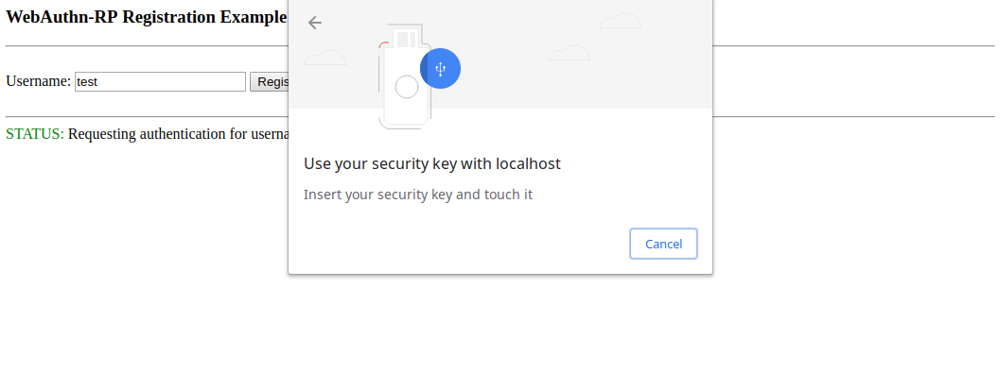
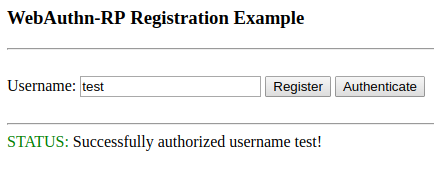

========
Authenticating Credential
========

To authenticate the same user, `test`, that was registered previously we can do the following.

1. Type in the username, `test`, and hit authenticate to get the request options and use them to prompt the user to insert and then touch their key.

2. After using a security key that has a none-attestation, send back the assertion object
and finish authenticating.

