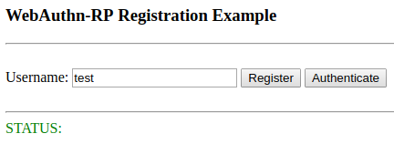
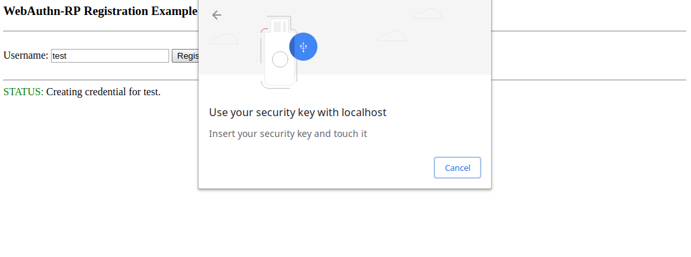
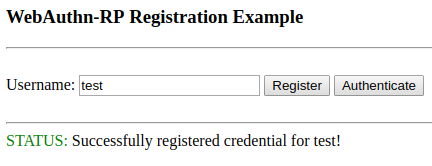

========
Registering Credential
========

Now that everything has been setup, we can register a credential for an examle username, `test`.

1. Type in a username.

2. Hit register to get the creation options and use them to prompt the user to insert and then touch their key.

3. After using a security key that has a none-attestation, send back the attestation object
and finish registering.

