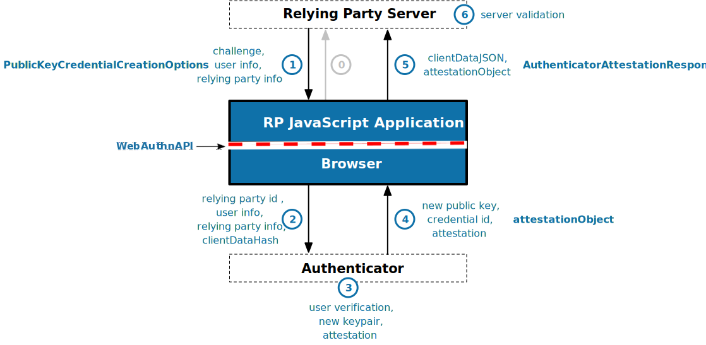

.. webauthn-rp documentation master file, created by
   sphinx-quickstart on Thu Apr 25 18:41:52 2019.
   You can adapt this file completely to your liking, but it should at least
   contain the root `toctree` directive.

webauthn-rp
===========

.. figure:: _static/webauthn-rp-logo.png
  :alt: Webauthn Logo
  :align: center

`webauthn-rp` is an implementation of the Relying Party components of the 
`Web Authentication (WebAuthn) standard`_ which was made official in March of 2019.
It aims to be a quick and easy way to use public key credentials for your Python
applications. Support is only for Python 3.x considering that Python 2.x will reach
its end of life in early 2020. This allows for the use of many features of Python 3 such
as built-in type hinting and static type checking with mypy.

You can integrate this library into any backend web framework by implementing an
interface that abstracts the operations that you'll need to perform as a public key
credential registrar (explained in more detail in the docs).

The general flow diagram for web authentication is shown in the diagrams below (from the spec):

  
  WebAuthn Registration Flow (Figure 1 of WebAuthn Standard)

In the case of registration, the relying party server must send a challenge along with
information about the user that is to be registered and the specific relying party to
which that user is associated. This library is meant to aid in the generation of messages
used in step 1 and the validation performed in step 6. Steps 0 and 5 are typically
handled by an application-specific client library while the routing and parsing operations
of steps 1 and 6 will need to be managed by the application-specific backend although
some utilities are provided. Steps 2, 3, and 4 however, are completely managed by the
client's browser and authenticator and are not part of this library. In fact, they are
mostly covered by a different specification (the Client To Authenticator Protocol, or CTAP).

.. figure:: _static/webauthn-authentication-flow-01.svg
  :width: 750
  :alt: WebAuthn Authentication Flow
  :align: center
  
  WebAuthn Authentication Flow (Figure 2 of WebAuthn Standard)

Authentication is very much like registration, however some of the message formats are
different and consequently the parsing and validation operations as well. The steps
and how they are handled mirror those of the registration flow.

Installation
------------

The entire library is written in Python 3.x so you can install it easily using `pip`.

.. code-block:: bash

  pip install webauthn-rp

.. toctree::
   :maxdepth: 1
   :caption: API

   webauthn_rp

.. toctree::
   :maxdepth: 1
   :caption: Getting Started

   getting-started/main-concepts
   getting-started/server-configuration
   getting-started/client-configuration
   getting-started/registering-credential
   getting-started/authenticating-credential
   getting-started/error-handling
   getting-started/using-extensions

.. toctree::
   :maxdepth: 1
   :caption: User Documentation

   user-docs/backend
   user-docs/registrar
   user-docs/builders
   user-docs/utilities
   user-docs/attesters
   user-docs/converters
   user-docs/parsers
   user-docs/validators
   user-docs/verifiers
   user-docs/extensions

.. toctree::
   :maxdepth: 1
   :caption: Developer Documentation

   dev-docs/setup-environment
   dev-docs/running-tests
   dev-docs/running-linter
   dev-docs/writing-tests
   dev-docs/making-changes
   dev-docs/bug-reporting

.. _Web Authentication (WebAuthn) standard: https://www.w3.org/TR/webauthn/